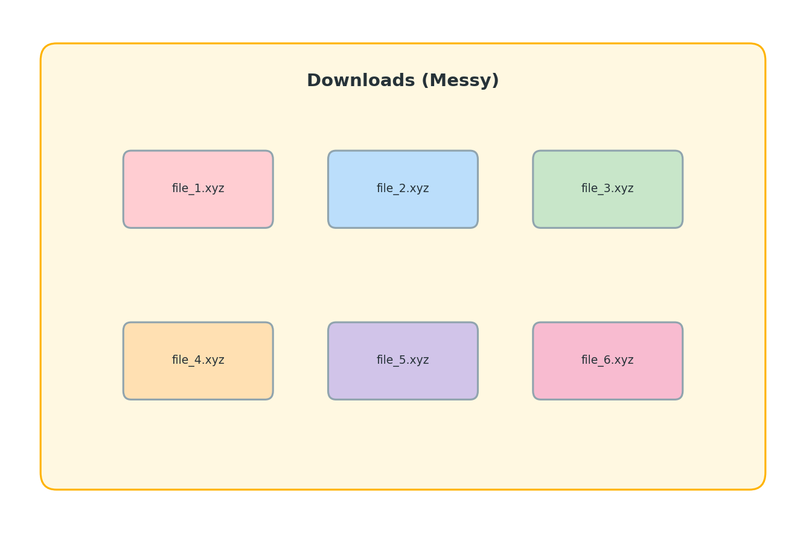
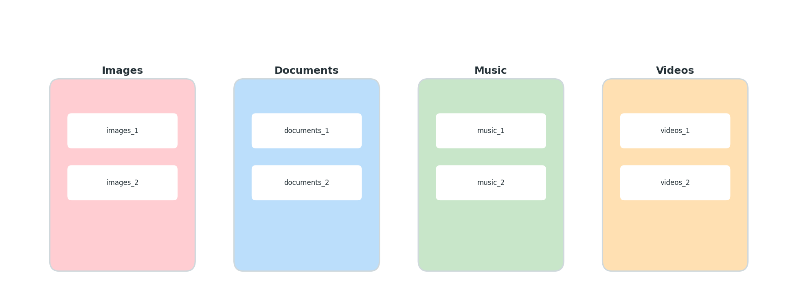
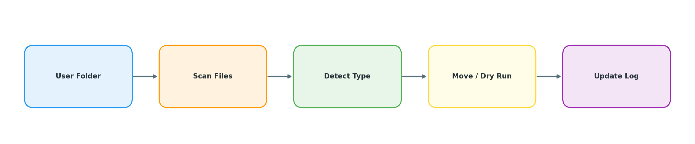

# 📂 File Organizer 

<div align="center">
  
  
  
</div>

---

<div align="center">
🇬🇧 [English](#english) | 🇻🇳 [Tiếng Việt](#vietnamese)
</div>

---

<a id="english"></a>

## 🇬🇧 English

### Overview

The upgraded **File Organizer** is a zero-dependency Python CLI that safely restructures messy folders. It ships with richer controls (copy vs move), custom destination roots, smarter configuration handling, exclusion patterns, depth limits, JSON reports, and dual-channel logging.

### Core features

* 🛡️ Dry-run preview plus explicit `--confirm` guard for real operations
* 📦 Move or **copy** files into category folders with conflict-safe renaming
* 🧭 Send organized files to a **custom destination root** while keeping history of source moves
* ↩️ Rollback for the latest move sessions (history stored in `move_history.json`)
* 🎯 Targeted scans via glob exclusions, max-depth limits, and optional hidden-file support
* ⚙️ Configurable categories with optional merge against built-in defaults
* 🧾 JSON summary report export and detailed logging (file + optional console)
* 🧹 Optional cleanup of empty folders after organizing

### Safety first

> * Never point the tool at system roots (e.g. `/`, `C:\`).
> * Always start with `--dry-run` before running with `--confirm`.
> * Rollback only applies to **move** runs recorded in history; copy mode is not rolled back.
> * Conflicting restores will be automatically renamed instead of overwriting files.

### Installation

```bash
git clone https://github.com/Minx-nie/desktop-cleaner.git
cd desktop-cleaner
```

Requires **Python 3.8+**. No external packages are needed.

### Usage

| Command | Description |
| --- | --- |
| `python cleaner.py --dry-run` | Preview actions on `~/Downloads` |
| `python cleaner.py --confirm` | Execute moves on `~/Downloads` |
| `python cleaner.py /path/to/folder --dry-run --exclude "*.zip"` | Skip matching files while previewing a custom folder |
| `python cleaner.py /path --confirm --mode copy --report report.json` | Copy into categories and write a JSON summary |
| `python cleaner.py /path --confirm --destination /organized` | Move files but place categorized folders in `/organized` |
| `python cleaner.py /path --confirm --max-depth 1 --include-hidden` | Process only the top level (and its direct children) including dotfiles |
| `python cleaner.py --rollback` | Roll back the latest move run |
| `python cleaner.py --rollback 20251221_153045` | Roll back a specific timestamped run |
| `python cleaner.py --list-history` | Show available rollback timestamps |

### Configuration

* **Destination root**: Use `--destination` to place category folders elsewhere (e.g., another drive).
* **Categories**: Edit `categories.json`. Use `--merge-defaults` to add to built-ins instead of replacing them.
* **Exclusions**: Provide `--exclude` glob patterns multiple times to skip files or folders.
* **Hidden files**: Include dotfiles with `--include-hidden` (otherwise they are skipped).
* **Depth control**: Restrict recursion with `--max-depth` (0 = root only).
* **Logging**: All runs write to `file_organizer.log`; add `--console-log` to stream logs to stdout.
* **Reports**: Save a structured summary via `--report path/to/report.json`.
* **Cleanup**: Disable empty-folder cleanup with `--no-cleanup` if desired.

### Categories

By default, files are grouped into: **Images, Documents, Archives, Installers, Videos, Music, Code, Others**. MIME detection is used as a fallback when extensions are unfamiliar.

### Visuals

<div align="center">
Messy Folder 

Cleaned Folder 

Workflow Diagram 
</div>

---

<a id="vietnamese"></a>

## 🇻🇳 Tiếng Việt

### Tổng quan

Bản nâng cấp **File Organizer** là CLI Python không phụ thuộc thư viện ngoài, giúp dọn thư mục lộn xộn an toàn hơn. Phiên bản mới hỗ trợ chọn chế độ **di chuyển hoặc sao chép**, đẩy kết quả tới thư mục đích tùy chọn, gộp cấu hình với mặc định, bộ lọc loại trừ, giới hạn độ sâu, xuất báo cáo JSON và ghi log song song.

### Tính năng chính

* 🛡️ Xem trước với `--dry-run`, chạy thật cần `--confirm`
* 📦 Di chuyển **hoặc sao chép** file vào thư mục phân loại, tự xử lý trùng tên
* 🧭 Có thể xuất kết quả sang thư mục đích tùy chọn bằng `--destination`
* ↩️ Hoàn tác cho các lần **move** gần nhất (lưu trong `move_history.json`)
* 🎯 Quét có mục tiêu: pattern loại trừ, giới hạn độ sâu, tuỳ chọn xử lý file ẩn
* ⚙️ Tuỳ chỉnh nhóm file, có thể gộp (`--merge-defaults`) với mặc định
* 🧾 Xuất báo cáo JSON, ghi log ra file và tuỳ chọn hiển thị ra màn hình
* 🧹 Có thể bật/tắt dọn thư mục trống sau khi sắp xếp

### Lưu ý an toàn

> * Không chạy ở thư mục gốc hệ thống (`/`, `C:\`).
> * Luôn thử bằng `--dry-run` trước khi `--confirm`.
> * Rollback chỉ áp dụng cho lần chạy **move** đã được ghi lịch sử; chế độ copy không rollback.
> * Khi khôi phục, file trùng tên sẽ được đổi tên để tránh ghi đè.

### Cách dùng nhanh

| Lệnh | Mô tả |
| --- | --- |
| `python cleaner.py --dry-run` | Xem trước tại `~/Downloads` |
| `python cleaner.py --confirm` | Di chuyển thật tại `~/Downloads` |
| `python cleaner.py /duongdan --dry-run --exclude "*.zip"` | Bỏ qua các file khớp pattern khi xem trước |
| `python cleaner.py /duongdan --confirm --mode copy --report bao_cao.json` | Sao chép vào thư mục phân loại và lưu báo cáo JSON |
| `python cleaner.py /duongdan --confirm --destination /thu_muc_dich` | Di chuyển nhưng lưu thư mục phân loại vào đường dẫn mới |
| `python cleaner.py /duongdan --confirm --max-depth 1 --include-hidden` | Chỉ quét tầng gốc + thư mục con trực tiếp, có xử lý file ẩn |
| `python cleaner.py --rollback` | Hoàn tác lần chạy gần nhất |
| `python cleaner.py --rollback 20251221_153045` | Hoàn tác lần chạy theo timestamp |
| `python cleaner.py --list-history` | Xem danh sách lịch sử rollback |

### Tuỳ chỉnh

* **Nhóm file**: Sửa `categories.json`. Dùng `--merge-defaults` để gộp với mặc định.
* **Bỏ qua**: Thêm nhiều `--exclude` để loại trừ file/thư mục theo glob.
* **File ẩn**: Dùng `--include-hidden` để xử lý dotfiles (mặc định bỏ qua).
* **Giới hạn độ sâu**: `--max-depth` kiểm soát mức đệ quy (0 = chỉ thư mục gốc).
* **Ghi log**: Log lưu ở `file_organizer.log`, thêm `--console-log` để hiện ra màn hình.
* **Báo cáo**: `--report` xuất kết quả dạng JSON.
* **Dọn thư mục trống**: Tắt với `--no-cleanup` nếu không muốn xoá.

### Nhóm mặc định

Mặc định, file được phân thành: **Images, Documents, Archives, Installers, Videos, Music, Code, Others**. Tool dùng MIME để nhận diện khi phần mở rộng không rõ ràng.

### Giấy phép

MIT License — tác giả gốc: **Minx-nie**
